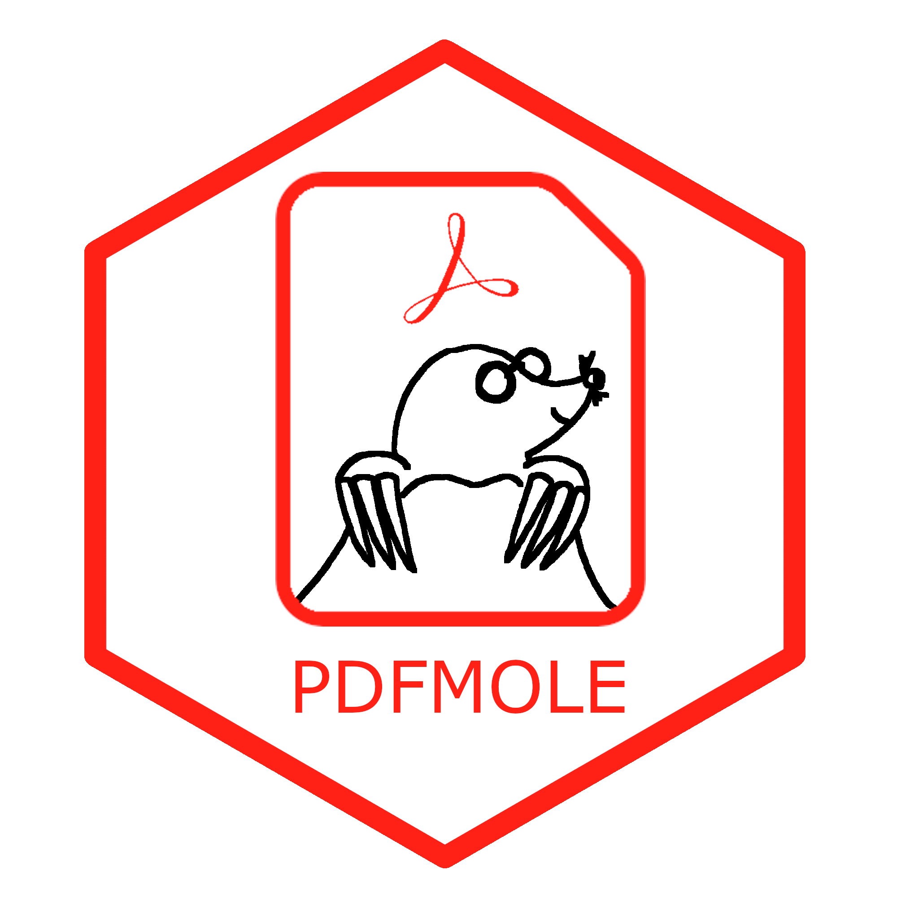
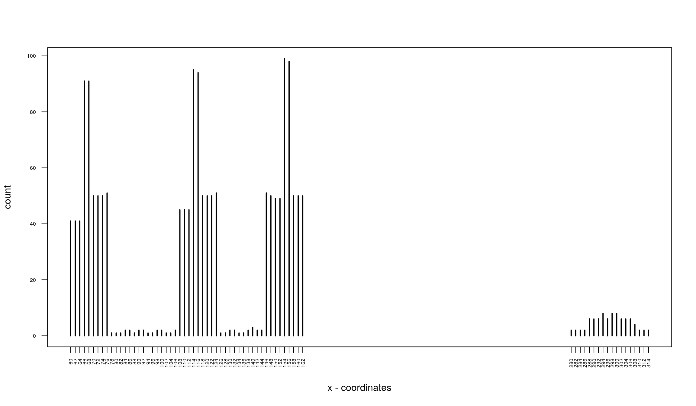
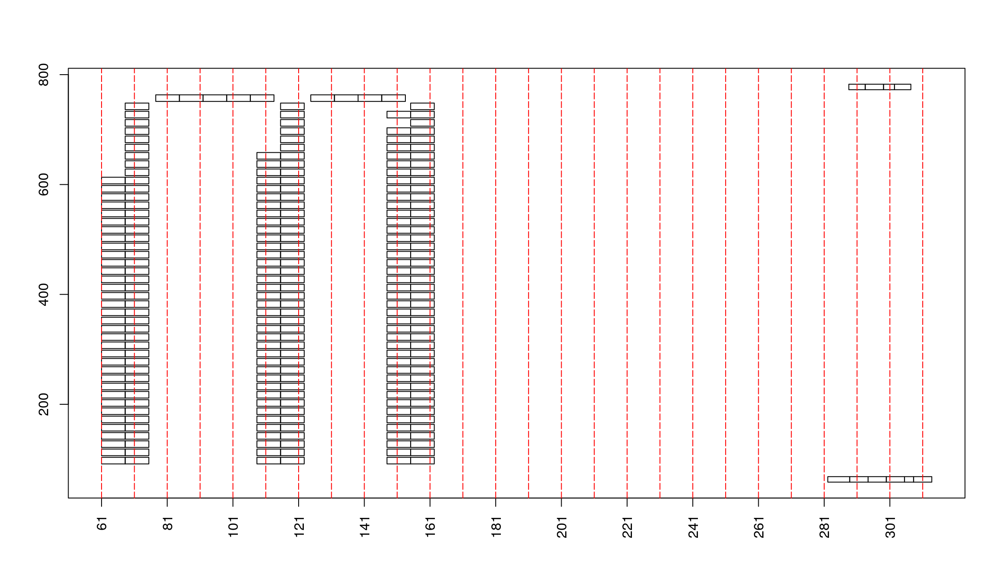
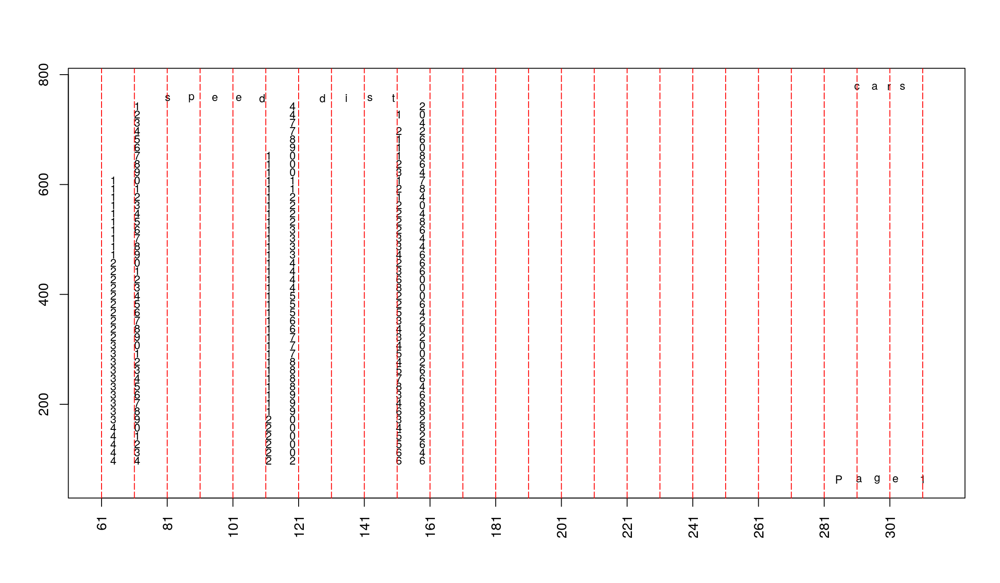

<!-- README.md is generated from README.Rmd. Please edit that file -->

# pdfmole <a href='https://github.com/ben-schwen/pdfmole'></a>

<!-- badges: start -->
[](https://travis-ci.com/ben-schwen/pdfmole)
<!-- badges: end -->

The **pdfmole** package provides a bundle of functions designed to assist in
extracting tables from PDF-files. To read-in the data we use the [**pdfminer**](https://github.com/FlorianSchwendinger/pdfminer)
package, however any package which returns the data in a similar format
could be used.

## Installation

```r
# Install dev versions from GitHub:
# install.packages("devtools")

# install pdfminer
devtools::install_github("FlorianSchwendinger/pdfminer")

# install pdfmole
devtools::install_github("ben-schwen/pdfmole")
```

## Workflow

```r
options(width = 100)
library("pdfminer")
library("pdfmole")
```

The basic work flow of **pdfmole** can be divided into

1. read data (`pdfminer::read.pdf()`)
2. align rows (`align_rows(x, method, ...)`)
3. aligns columns (`align_columns(x, method, ...)`)
4. group columns (`group_columns(x, collapse)`)
5. transform the data into a rectangular format (`mole(x, header, simplify, keep)`)

## Warning
**pdfmole** is not finished yet the basic functionality works but there might
be still some changes ahead when additional backends (functions to read in data
from PDF-files) are added. Currently there are plans to add backends to
[Apache PDFBox](https://pdfbox.apache.org/) and
[Tesseract](https://github.com/tesseract-ocr/tesseract).

## Example usage
### Read data
Use **pdfminer** to read the PDF-file into **R**,

```r
pdf_file <- file.path(system.file("pdfs", package = "pdfmole"), "cars.pdf")
pdf <- read.pdf(pdf_file, pages = 1:2, maxpages = 2L)
pdf
```

```
## A pdf document with 2 pages and
##   metainfo text line rect curve figure textline textbox textgroup image
## 1        2  469    0    0     0      0      155      10         8     0
## elements.
```
**pdfminer** returns an object of class `"pdf_document"` which is a
list containing several `data.frames`, the print method shows the number of
rows of each `data.frame`.
Each `data.frame` contains specific information about the PDF-file,
for example the `data.frame` contains meta information about the PDF-file.

```r
pdf$metainfo
```

```
##   pid rotate x0 y0  x1  y1
## 1   1      0  0  0 595 842
## 2   2      0  0  0 595 842
```

The columns are defined as follows.

Name       | Description
---------- | -----------------------------------------------
`pid`      | page id
`rotation` | the rotation of the page
`x0`       | the bounding box start coordinate on the x-axis
`x1`       | the bounding box end coordinate on the x-axis
`y0`       | the bounding box start coordinate on the y-axis
`y1`       | the bounding box end coordinate on the y-axis


The `data.frame` named `text` contains the *page id*, *block id*, *font name*,
*font size*, *name of the color space*, *color* and *bounding box* for each
character of the PDF-file.

```r
d0 <- pdf$text
head(d0)
```

```
##   pid block text         font size colorspace     color    x0      y0    x1      y1
## 1   1     1    s Courier-Bold   12 DeviceGray [0, 0, 0]  77.2 751.272  84.4 763.272
## 2   1     1    p Courier-Bold   12 DeviceGray [0, 0, 0]  84.4 751.272  91.6 763.272
## 3   1     1    e Courier-Bold   12 DeviceGray [0, 0, 0]  91.6 751.272  98.8 763.272
## 4   1     1    e Courier-Bold   12 DeviceGray [0, 0, 0]  98.8 751.272 106.0 763.272
## 5   1     1    d Courier-Bold   12 DeviceGray [0, 0, 0] 106.0 751.272 113.2 763.272
## 6   1    NA                     NA                         NA      NA    NA      NA
```

Based on this information we want to assign a row and column id to each
row of the `data.frame`. This will allow us to transform character level
`data.frame` into the typical format. Additionally we can use information like
the location, font size or font type to filter out specific characters /
blocks / rows.

### Align blocks (optional)
The block information is assigned by **pdfminer** and signals which characters
belong to the same text block. The function `group_blocks` can be use to
paste together all the characters belonging to the same block.

```r
d <- group_blocks(d0)
head(d, 3)
```

```
##   pid  text         font size colorspace     color    x0      y0    x1      y1
## 1   1 speed Courier-Bold   12 DeviceGray [0, 0, 0]  77.2 751.272 113.2 763.272
## 2   1  dist Courier-Bold   12 DeviceGray [0, 0, 0] 124.4 751.272 153.2 763.272
## 3   1     4      Courier   12 DeviceGray [0, 0, 0] 115.2 736.272 122.4 748.272
```

### Align rows
The function `align_rows(x, method, ...)` currently implements three methods
`"exact_match"`, `"hclust"` and `"fixed_width"`.

```r
d <- align_rows(d0)
head(d, 3)
```

```
##   pid block text         font size colorspace     color   x0      y0   x1      y1 row
## 1   1     1    s Courier-Bold   12 DeviceGray [0, 0, 0] 77.2 751.272 84.4 763.272   2
## 2   1     1    p Courier-Bold   12 DeviceGray [0, 0, 0] 84.4 751.272 91.6 763.272   2
## 3   1     1    e Courier-Bold   12 DeviceGray [0, 0, 0] 91.6 751.272 98.8 763.272   2
```

### Align columns

#### Visualization

```r
pixelplot(d, scale = 0.5, cex.axis = 0.55)
```




```r
bboxplot(d, pid = 1L)
```




```r
textplot(d, pid = 1L)
```




```r
d <- align_columns(d, split_points = c(78, 126, 220))
head(d, 3)
```

```
##   pid block text         font size colorspace     color   x0      y0   x1      y1 row col
## 1   1     1    s Courier-Bold   12 DeviceGray [0, 0, 0] 77.2 751.272 84.4 763.272   2   2
## 2   1     1    p Courier-Bold   12 DeviceGray [0, 0, 0] 84.4 751.272 91.6 763.272   2   2
## 3   1     1    e Courier-Bold   12 DeviceGray [0, 0, 0] 91.6 751.272 98.8 763.272   2   2
```


### Filter

```r
d <- d[grep("Courier", d$font),]
```

### Group

```r
d <- group_columns(d)
head(d, 3)
```

```
##   pid row col  text
## 1   1   2   2 speed
## 2   1   2   3  dist
## 3   1   3   1     1
```

### Mole
After the grouping the data is available similar to a simple triplet sparse
matrix format (sometimes called coordinate format).
To obtain the usual `data.frame`  / `matrix` format the function `mole()`
can be used.

```r
x <- mole(d, header = TRUE, simplify = TRUE)
x
```

```
## X1   speed  dist
## 1    4      2
## 2    4      10
## 3    7      4
## 4    7      22
## 5    8      16
## 6    9      10
## ...  ...    ...
## 9    10     34
## 14   12     24
## 15   12     28
## 17   13     34
## 18   13     34
## 19   13     46
## 20   14     26
## 21   14     36
## 25   15     26
## 27   16     32
## 28   16     40
## 30   17     40
## 31   17     50
## 35   18     84
## 39   20     32
## 42   20     56
## ...  ...    ...
## 45   23     54
## 46   24     70
## 47   24     92
## 48   24     93
## 49   24     120
## 50   25     85
```
The function `mole()` returns an object of class `mole`,

```r
str(x)
```

```
## List of 3
##  $ X1   : int [1:50] 1 2 3 4 5 6 7 8 9 10 ...
##  $ speed: int [1:50] 4 4 7 7 8 9 10 10 10 11 ...
##  $ dist : int [1:50] 2 10 4 22 16 10 18 26 34 17 ...
##  - attr(*, "class")= chr "mole"
```
which can be coerced to either `data.frame`

```r
head(as.data.frame(x))
```

```
##   X1 speed dist
## 1  1     4    2
## 2  2     4   10
## 3  3     7    4
## 4  4     7   22
## 5  5     8   16
## 6  6     9   10
```
or `matrix`.

```r
head(as.matrix(x))
```

```
##      X1 speed dist
## [1,]  1     4    2
## [2,]  2     4   10
## [3,]  3     7    4
## [4,]  4     7   22
## [5,]  5     8   16
## [6,]  6     9   10
```


```r
0
```

```
## [1] 0
```


```r
0
```

```
## [1] 0
```
